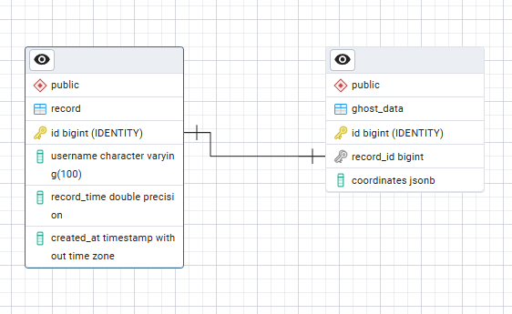

# TimeAttack Runner Backend

출발선에서 시작하여 완주 지점까지의 시간 기록을 측정합니다.
 플레이어의 주행 기록을 저장하고, 1등 유저의 이동 경로를 리플레이 할 수 있도록 '고스트 데이터'를 제공합니다.

## Tech Stack

 
 
 
 

### 기술 선정 이유
#### 1. Java21
* **Record 타입 사용:** DTO 작성 시 불변성을 보장하고, 코드를 간결하게 유지합니다.
* **Virtual Thread:** 추후 채팅 서버 구현 시, 높은 동시성 처리가 가능합니다.
* **JIT 컴파일러 & 정적 타입:** 명확한 데이터 구조를 다루는 프로젝트이기에, 컴파일 단계에서 안정성을 확보합니다.

#### 2.Spring Boot 3.5.7
* **Java21 호환성:** Virtual Threads 등 최신 Java 기능을 지원합니다.
* **생태계:** 많은 레퍼런스와 검증된 라이브러리를 보유하여, 빠른 개발이 가능합니다.
#### 3. Gradle
* **가독성:** 간결한 스크립트 작성이 가능합니다.
#### 4. PostgreSQL (+ H2)
* **JSONB 지원:** 고스트 데이터(좌표 배열)를 효율적으로 저장하기 위해, JSON 처리가 우수한 PostgreSQL을 채택했습니다.
* **H2 인메모리:** 테스트 환경에서 H2를 사용하여, 속도와 격리성을 확보했습니다.
 

## Key Features
* **고스트 리플레이:** 플레이어의 이동 경로(좌표 배열)를 JSON으로 직렬화하여 저장 및 조회
* **타임어택 랭킹:** 주행 기록을 오름차순으로 정렬하여, Top5 리더보드 제공

 

## ERD

 

## API Usage
| Method | URI                               | Description                    |
| :--- |:----------------------------------|:-------------------------------|
| `POST` | `/api/record`                     | 시간 기록, 플레이어 이름, 고스트 데이터(좌표) 저장 |
| `GET` | `/api/record/leaderboard?top={n}` | 상위 기록 N개 조회       |
| `GET` | `/api/ghost/{recordId}`           | 특정 기록(`recordId`)의 고스트 좌표 조회   |